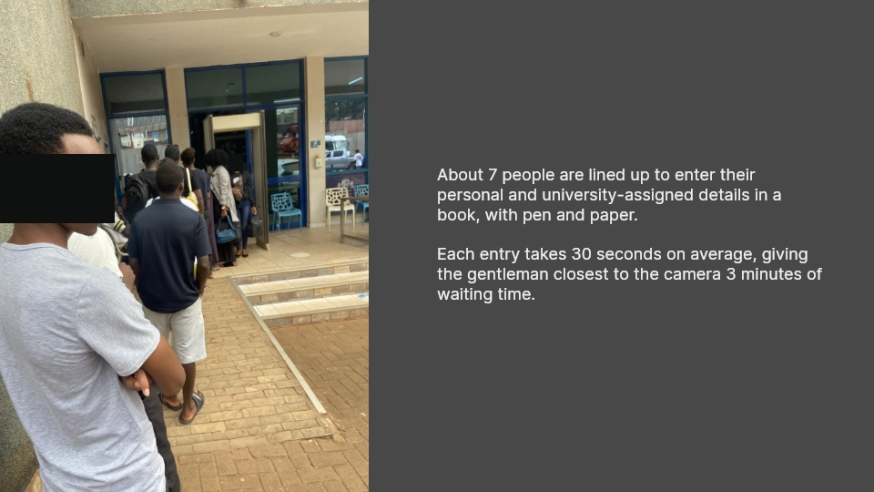
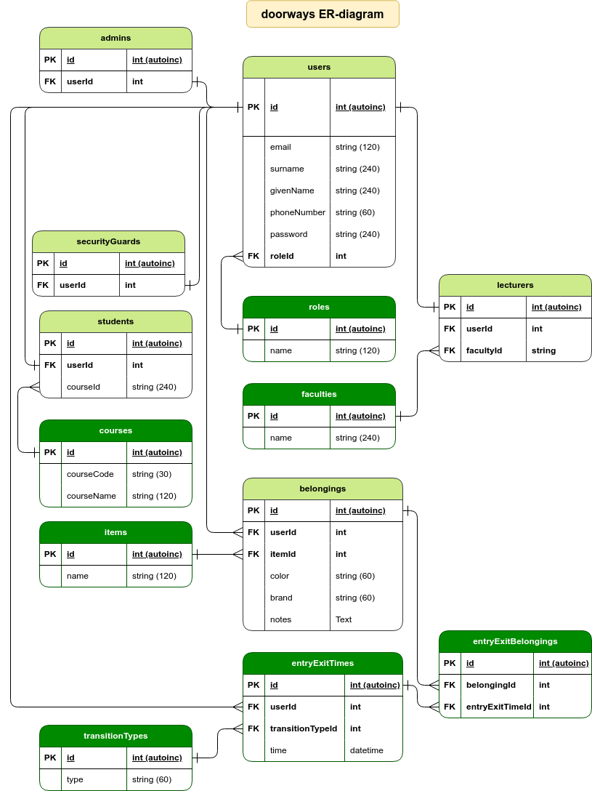

# doorways

A Checkpoint management system for students and lecturers, using randomized, ephemeral short-codes.
\
Case study: Cavendish University Uganda

## Background

Doorways aims to set up secure, consistent, and efficient checkpoint management  for students and lecturers,
\
without the need for separate physical hardware (RFIDs, Finger-print readers, Separate cameras, etc.), that all need installation and maintenance.
\
\
This project was conceived to primarily solve the queueing problem at Cavendish University Uganda, where students and lecturers would
\
queue for minutes on end to check in and out of the university premises.
\
\

## E-R diagram for the application

